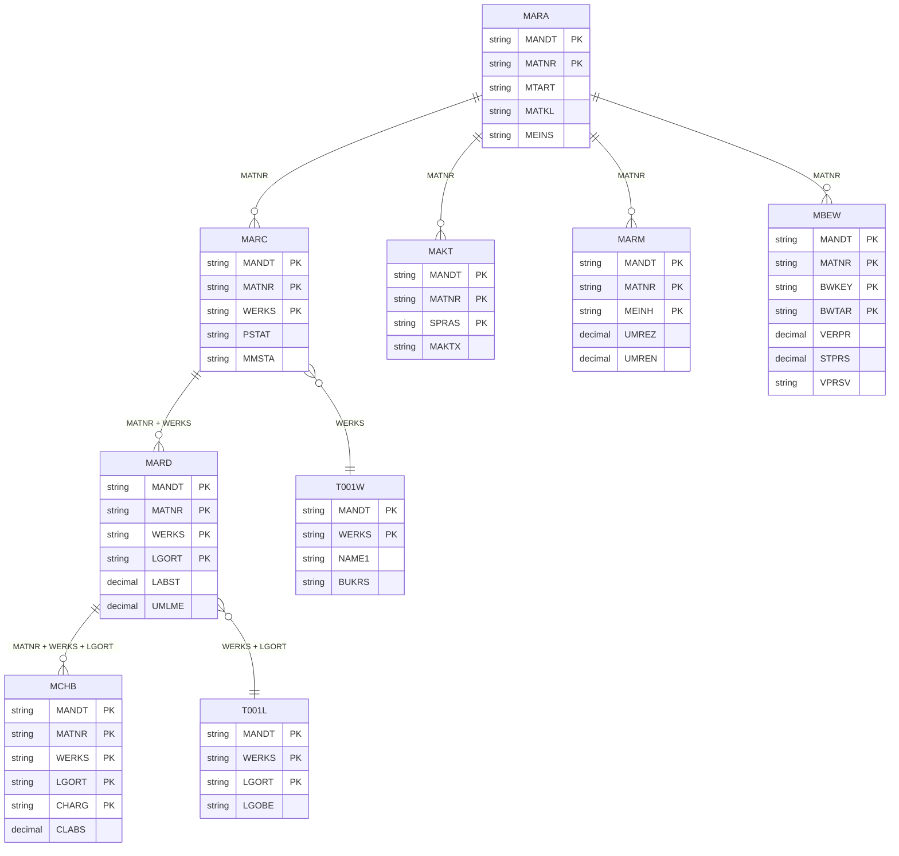
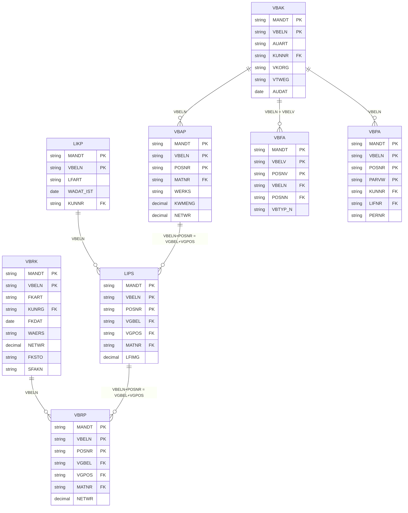
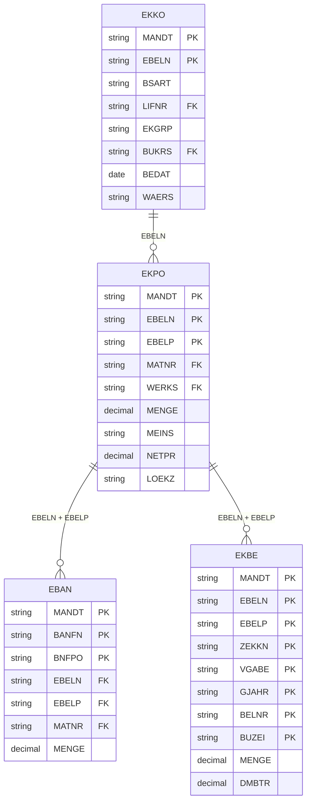
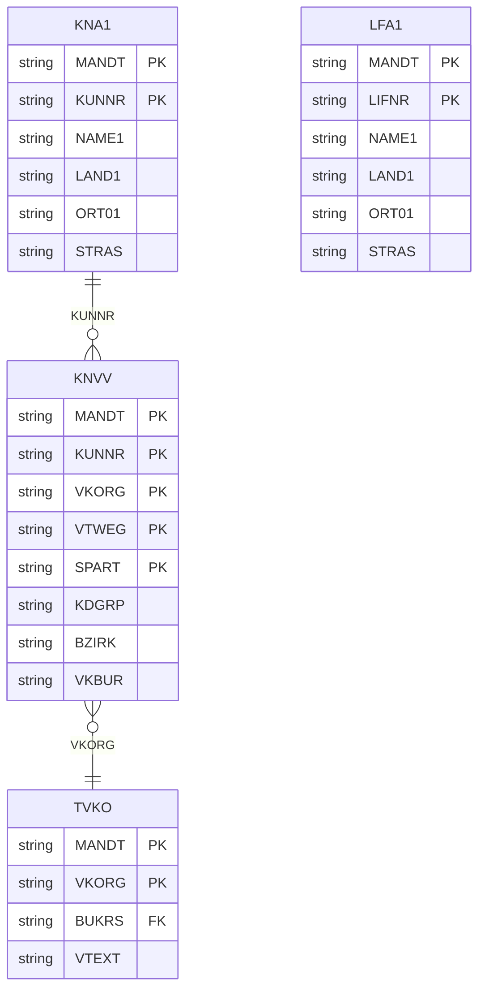
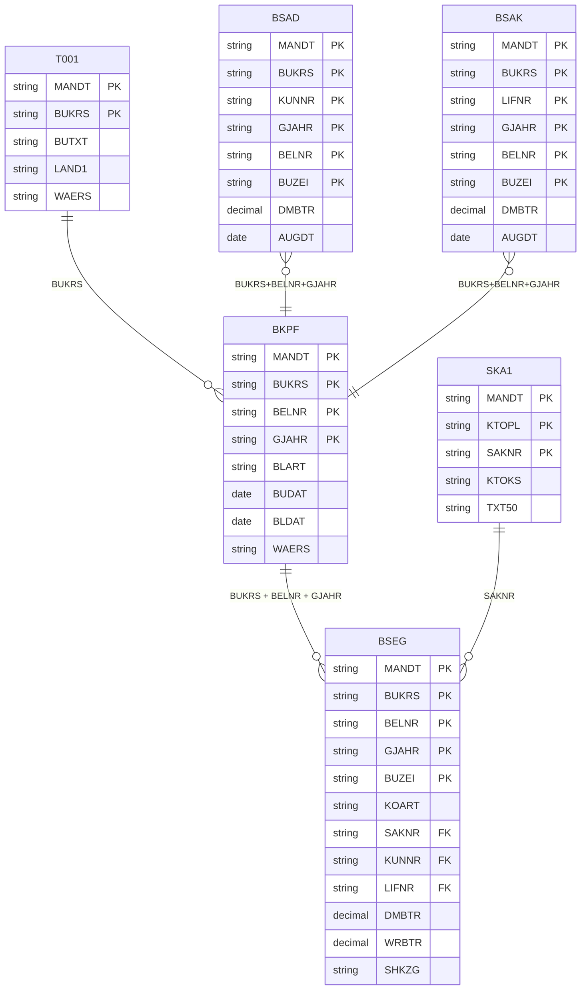
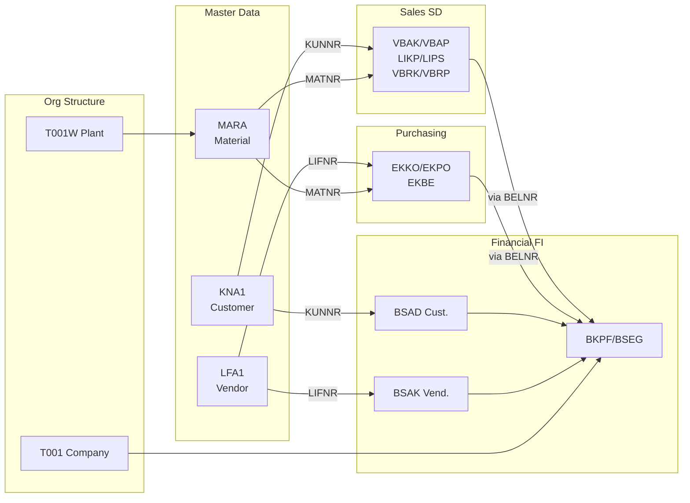

# SAP Table Relationships — MER & DER Guide

> Guide to SAP table structures, primary keys, and join relationships across modules.
> Target environment: Unity Catalog `bronze.sap.<table_lowercase>`

---

## Legend

| Symbol | Meaning |
|--------|---------|
| `PK` | Primary Key field |
| `FK` | Foreign Key (join field) |
| `||--o{` | One-to-Many |
| `}o--||` | Many-to-One |

---

## 1. MER — Conceptual Model

> High-level view of SAP business domains and how they connect.

```mermaid
graph TB
    subgraph MM["MM — Materials Management"]
        MARA["MARA\nMaterial Master"]
        MARC["MARC\nPlant Data"]
        MARD["MARD\nStorage Location"]
        MAKT["MAKT\nDescriptions"]
        MARM["MARM\nUnits of Measure"]
        MBEW["MBEW\nValuation"]
        MCHB["MCHB\nBatch Stocks"]
    end
    subgraph SD["SD — Sales & Distribution"]
        VBAK["VBAK\nSales Order Header"]
        VBAP["VBAP\nSales Order Items"]
        LIKP["LIKP\nDelivery Header"]
        LIPS["LIPS\nDelivery Items"]
        VBRK["VBRK\nBilling Header"]
        VBRP["VBRP\nBilling Items"]
        VBFA["VBFA\nDoc Flow"]
        VBPA["VBPA\nPartner Functions"]
    end
    subgraph PUR["MM-PUR — Purchasing"]
        EKKO["EKKO\nPO Header"]
        EKPO["EKPO\nPO Items"]
        EBAN["EBAN\nRequisition"]
        EKBE["EKBE\nPO History"]
    end
    subgraph BP["Business Partners"]
        KNA1["KNA1\nCustomer Master"]
        LFA1["LFA1\nVendor Master"]
        KNVV["KNVV\nCustomer Sales Data"]
    end
    subgraph FI["FI — Financial Accounting"]
        BKPF["BKPF\nAccounting Doc Header"]
        BSEG["BSEG\nAccounting Doc Items"]
        SKA1["SKA1\nG/L Account Master"]
        BSAD["BSAD\nCleared Customer Items"]
        BSAK["BSAK\nCleared Vendor Items"]
    end
    subgraph ORG["Organizational Structure"]
        T001["T001\nCompany Codes"]
        T001W["T001W\nPlants"]
        T001L["T001L\nStorage Locations"]
        TVKO["TVKO\nSales Organizations"]
    end

    MARA --> MARC
    MARA --> MAKT
    MARA --> MARM
    MARA --> MBEW
    MARC --> MARD
    MARD --> MCHB

    VBAK --> VBAP
    LIKP --> LIPS
    VBRK --> VBRP
    VBAK --> VBFA
    LIKP --> VBFA
    VBRK --> VBFA
    VBAK --> VBPA

    EKKO --> EKPO
    EKPO --> EBAN
    EKPO --> EKBE

    KNA1 --> KNVV
    KNA1 --> VBAK
    KNA1 --> BSAD
    LFA1 --> EKKO
    LFA1 --> BSAK

    BKPF --> BSEG
    SKA1 --> BSEG

    MARA --> VBAP
    MARA --> EKPO
    MARA --> LIPS
    T001 --> BKPF
    T001W --> MARC
    T001L --> MARD
```



---

## 2. DER — MM Materials Management



### MM Join SQL Reference

```sql
-- Material with plant data, descriptions and stock
SELECT m.matnr, m.mtart, m.matkl, t.maktx, p.werks, d.lgort, d.labst
FROM bronze.sap.mara m
INNER JOIN bronze.sap.marc p ON m.matnr = p.matnr
INNER JOIN bronze.sap.makt t ON m.matnr = t.matnr AND t.spras = 'P'
LEFT  JOIN bronze.sap.mard d ON p.matnr = d.matnr AND p.werks = d.werks
WHERE m.mtart = 'FERT';

-- Material unit cost (valuation)
SELECT m.matnr, v.verpr, v.stprs, v.vprsv
FROM bronze.sap.mara m
INNER JOIN bronze.sap.mbew v ON m.matnr = v.matnr AND v.bwkey = 'BR01';
```

---

## 3. DER — SD Sales & Distribution

> SD has a 3-level document chain: **Sales Order -> Delivery -> Billing**.
> Items link via reference fields VGBEL (source document) + VGPOS (source item).



### SD — VBFA VBTYP_N Codes

| Code | Document Type | Target Table |
|------|--------------|--------------|
| `C`  | Sales Order  | VBAK / VBAP  |
| `J`  | Delivery     | LIKP / LIPS  |
| `M`  | Invoice / Billing | VBRK / VBRP |
| `R`  | Returns / Fiscal Doc | VBRK |

### SD Join SQL Reference

```sql
-- Full chain: Order -> Delivery -> Billing
SELECT
    ord.vbeln AS order_number, oitem.posnr AS order_item, oitem.matnr,
    oitem.kwmeng AS qty_ordered,
    del.vbeln AS delivery_number, ditem.lfimg AS qty_delivered,
    bil.vbeln AS invoice_number, bil.fkdat AS invoice_date, bitem.netwr AS net_value
FROM bronze.sap.vbak  ord
INNER JOIN bronze.sap.vbap  oitem ON ord.vbeln  = oitem.vbeln
INNER JOIN bronze.sap.lips  ditem ON ditem.vgbel = oitem.vbeln AND ditem.vgpos = oitem.posnr
INNER JOIN bronze.sap.likp  del   ON del.vbeln   = ditem.vbeln
INNER JOIN bronze.sap.vbrp  bitem ON bitem.vgbel = ditem.vbeln AND bitem.vgpos = ditem.posnr
INNER JOIN bronze.sap.vbrk  bil   ON bil.vbeln   = bitem.vbeln
WHERE ord.auart = 'OR';

-- IMPORTANT: For item-level delivery lookup, use LIPS (not VBFA)
-- VBFA returns ALL items for a document; LIPS gives precise item-to-item link
SELECT d.vbeln AS delivery, d.posnr AS del_item
FROM bronze.sap.lips d
WHERE d.vgbel = '0000123456' AND d.vgpos = '000010';
```

---

## 4. DER — MM-PUR Purchasing



### EKBE — VGABE Movement Category

| VGABE | Description |
|-------|-------------|
| `1` | Goods Receipt (GR) |
| `2` | Invoice Receipt (IR) |
| `3` | Subsequent Debit/Credit |
| `4` | Return Delivery |
| `6` | Cancellation |
| `7` | Delivery Costs |

### Purchasing Join SQL Reference

```sql
-- PO with GR and IR totals
SELECT
    h.ebeln, h.lifnr, i.ebelp, i.matnr, i.menge AS qty_ordered,
    SUM(CASE WHEN e.vgabe = '1' THEN e.menge ELSE 0 END) AS qty_received,
    SUM(CASE WHEN e.vgabe = '2' THEN e.dmbtr ELSE 0 END) AS value_invoiced
FROM bronze.sap.ekko h
INNER JOIN bronze.sap.ekpo i ON h.ebeln = i.ebeln
LEFT  JOIN bronze.sap.ekbe e ON i.ebeln = e.ebeln AND i.ebelp = e.ebelp
WHERE h.bsart = 'NB'
  AND (i.loekz IS NULL OR i.loekz = '')
GROUP BY h.ebeln, h.lifnr, i.ebelp, i.matnr, i.menge;
```

---

## 5. DER — Business Partners



### Business Partner SQL Reference

```sql
-- Customer with sales area
SELECT c.kunnr, c.name1, c.land1, s.vkorg, s.kdgrp, s.bzirk
FROM bronze.sap.kna1 c
INNER JOIN bronze.sap.knvv s ON c.kunnr = s.kunnr
WHERE s.vkorg = 'BR01';

-- Vendor on POs
SELECT h.ebeln, h.bedat, v.lifnr, v.name1, v.land1
FROM bronze.sap.ekko h
INNER JOIN bronze.sap.lfa1 v ON h.lifnr = v.lifnr;
```

---

## 6. DER — FI Financial Accounting



### BSEG — KOART Account Type

| KOART | Description |
|-------|-------------|
| `D`   | Customer (Debtor) |
| `K`   | Vendor (Creditor) |
| `S`   | G/L Account |
| `A`   | Fixed Assets |
| `M`   | Material |

### FI SQL Reference

```sql
-- Accounting doc with G/L line items
SELECT h.belnr, h.budat, h.blart, i.buzei, i.saknr, i.dmbtr,
       i.shkzg,  -- 'S' = debit, 'H' = credit
       g.txt50 AS account_desc
FROM bronze.sap.bkpf h
INNER JOIN bronze.sap.bseg i ON h.bukrs = i.bukrs
                             AND h.belnr = i.belnr
                             AND h.gjahr = i.gjahr
LEFT  JOIN bronze.sap.ska1 g ON i.saknr = g.saknr
WHERE h.bukrs = 'BR01' AND h.gjahr = '2025' AND i.koart = 'S';
```

---

## 7. Cross-Module Relationship Map



---

## 8. Primary Key Reference — All Tables

| Table | Module | Primary Key Fields | Notes |
|-------|--------|--------------------|-------|
| `MARA` | MM | MANDT, MATNR | Root of all material data |
| `MARC` | MM | MANDT, MATNR, WERKS | One row per plant |
| `MARD` | MM | MANDT, MATNR, WERKS, LGORT | One row per storage location |
| `MAKT` | MM | MANDT, MATNR, SPRAS | Filter spras; 'P' = Portuguese |
| `MARM` | MM | MANDT, MATNR, MEINH | Alternative UoM conversions |
| `MBEW` | MM | MANDT, MATNR, BWKEY, BWTAR | Valuation per valuation area |
| `MCHB` | MM | MANDT, MATNR, WERKS, LGORT, CHARG | Batch-level stock |
| `VBAK` | SD | MANDT, VBELN | Sales order; VBELN = 10-digit |
| `VBAP` | SD | MANDT, VBELN, POSNR | POSNR = 6-digit (000010, 000020) |
| `LIKP` | SD | MANDT, VBELN | Delivery; own VBELN namespace |
| `LIPS` | SD | MANDT, VBELN, POSNR | Join to VBAP via VGBEL+VGPOS |
| `VBRK` | SD | MANDT, VBELN | Billing; own VBELN namespace |
| `VBRP` | SD | MANDT, VBELN, POSNR | Join to LIPS via VGBEL+VGPOS |
| `VBFA` | SD | MANDT, VBELV, POSNV, VBELN, POSNN | Doc flow graph; filter VBTYP_N |
| `VBPA` | SD | MANDT, VBELN, POSNR, PARVW | PARVW = partner function role |
| `EKKO` | PUR | MANDT, EBELN | PO number = 10-digit EBELN |
| `EKPO` | PUR | MANDT, EBELN, EBELP | EBELP = 5-digit item (00010) |
| `EBAN` | PUR | MANDT, BANFN, BNFPO | Purchase requisition |
| `EKBE` | PUR | MANDT, EBELN, EBELP, ZEKKN, VGABE, GJAHR, BELNR, BUZEI | 8-field composite key |
| `KNA1` | BP | MANDT, KUNNR | Customer number |
| `KNVV` | BP | MANDT, KUNNR, VKORG, VTWEG, SPART | One row per sales area |
| `LFA1` | BP | MANDT, LIFNR | Vendor number |
| `BKPF` | FI | MANDT, BUKRS, BELNR, GJAHR | 3-field key; GJAHR = fiscal year |
| `BSEG` | FI | MANDT, BUKRS, BELNR, GJAHR, BUZEI | BUZEI = line item number |
| `SKA1` | FI | MANDT, KTOPL, SAKNR | Chart of accounts + G/L number |
| `BSAD` | FI | MANDT, BUKRS, KUNNR, ..., BELNR, BUZEI | Cleared customer open items |
| `BSAK` | FI | MANDT, BUKRS, LIFNR, ..., BELNR, BUZEI | Cleared vendor open items |
| `T001` | ORG | MANDT, BUKRS | Company code config |
| `T001W` | ORG | MANDT, WERKS | Plant config |
| `T001L` | ORG | MANDT, WERKS, LGORT | Storage location config |
| `TVKO` | ORG | MANDT, VKORG | Sales org config |

---

## 9. Common Join Patterns — Quick Reference

| Pattern | Tables | Join Condition | Notes |
|---------|--------|----------------|-------|
| Material + Description | MARA + MAKT | matnr AND spras='P' | Always filter language |
| Material + Plant | MARA + MARC | matnr | One row per plant |
| Material + Stock | MARC + MARD | matnr + werks | One row per lgort |
| Order Header + Items | VBAK + VBAP | vbeln | Header-Item pattern |
| Order to Delivery (item) | VBAP + LIPS | VBELN+POSNR = VGBEL+VGPOS | Reference fields in LIPS |
| Delivery to Billing (item) | LIPS + VBRP | VBELN+POSNR = VGBEL+VGPOS | Reference fields in VBRP |
| Any doc flow (header) | VBFA | vbelv = source.vbeln + vbtyp_n | NOT for item-level |
| PO Header + Items | EKKO + EKPO | ebeln | Header-Item pattern |
| PO + Goods Receipts | EKPO + EKBE | ebeln + ebelp | Filter vgabe = '1' |
| PO + Invoice Receipt | EKPO + EKBE | ebeln + ebelp | Filter vgabe = '2' |
| Accounting Docs | BKPF + BSEG | bukrs + belnr + gjahr | Three-field compound key |
| Customer + Sales Area | KNA1 + KNVV | kunnr + vkorg | One row per sales area |
| Customer + Orders | KNA1 + VBAK | kunnr | FK on VBAK |
| Vendor + POs | LFA1 + EKKO | lifnr | FK on EKKO |

---

## 10. Unity Catalog Naming

```
Standard mapping: bronze.sap.<table_lowercase>
  MARA  -> bronze.sap.mara
  VBAK  -> bronze.sap.vbak
  BKPF  -> bronze.sap.bkpf
  T001W -> bronze.sap.t001w

Braskem consolidated/renamed tables (Unity Catalog):
  DD07V + TVAUT -> tb_dd07t
    Column remaps: augru->domvalue_l, bezei->ddtext, spras->ddlanguage
    MUST add: WHERE domname = '<domain>'
  OIGS -> tb_oigsi
    Column remap: oig_sstsf -> oig_sstsfp
    Join: doc_number = likp.vbeln AND doc_typ = 'J'
  J_1BINDOC -> tb_j_1bnfdoc
    Missing: nfnet / nffre / nfins / nfoth columns
  VBPA (SD) -> tb_vbpa_salesorder
  KONV (PO) -> tb_konv_purchasingdoc
    Column remap: konwa -> kwaeh
  TVKGGT -> (verify) kdkg2->kdkgr, bezei->vtext

NOT in Unity Catalog (excluded):
  VEPO, VEKP, ZOATSD_BOOK_OVPO
```

---

## 11. Critical Gotchas for ABAP-to-SQL Conversion

| Scenario | ABAP | SQL / Delta Lake |
|----------|------|-----------------|
| Empty table + FOR ALL ENTRIES | Returns ALL rows (dangerous) | JOIN returns 0 rows — always guard |
| NULL vs empty CHAR | Stores '' | Delta may store NULL; use `(col IS NULL OR col = '')` |
| CHAR != 'X' check | Matches '' in ABAP | Use `(col IS NULL OR col != 'X')` |
| READ TABLE BINARY SEARCH | First match in key order | ROW_NUMBER() OVER (PARTITION BY ... ORDER BY etenr) pick rn=1 |
| MAKT language | spras = sy-langu (runtime) | Hardcode 'P' or parameterize |
| CONVERSION_EXIT_PARVW | Converts display code to internal parvw | SELECT DISTINCT parvw to verify value exists in UC |
| VBFA for item-level | Returns ALL items for doc | Use LIPS (vgbel = order, vgpos = item) instead |
| SY-SUBRC = 0 | Record found | INNER JOIN or WHERE EXISTS |
| SY-SUBRC != 0 | Not found | LEFT JOIN ... WHERE right.key IS NULL |
| OIGSI join | doc_number field | doc_number = likp.vbeln AND doc_typ = 'J' |
| PA0001 in UC | vorna/nachn columns | UC uses ename (pre-concatenated); pernr = 8-digit zero-padded |
